# Microservice Architecture Diagram

## Application Overview
This is a ticket booking microservice application with the following components:

```mermaid
graph TB
    %% External Access
    User[👤 User/Browser]
    
    %% Ingress Layer
    Ingress[🌐 Ingress Controller<br/>ticketing.dev]
    
    %% Frontend
    Client[🎨 Client App<br/>Next.js Frontend<br/>Port: 3000]
    
    %% Microservices
    Auth[🔐 Auth Service<br/>Node.js/Express<br/>Port: 3000<br/>JWT Authentication]
    Tickets[🎫 Tickets Service<br/>Node.js/Express<br/>Port: 3000<br/>Ticket Management]
    
    %% Message Broker
    NATS[NATS Streaming<br/>Message Broker<br/>Port: 4222<br/>Monitoring: 8222]
    
    %% Databases
    AuthDB[(🗄️ Auth MongoDB<br/>Port: 27017<br/>User Data)]
    TicketsDB[(🗄️ Tickets MongoDB<br/>Port: 27017<br/>Ticket Data)]
    
    %% Kubernetes Services
    ClientSrv[🔗 client-srv<br/>Service]
    AuthSrv[🔗 auth-srv<br/>Service]
    TicketsSrv[🔗 tickets-srv<br/>Service]
    NATSSrv[🔗 nats-srv<br/>Service]
    AuthMongoSrv[🔗 auth-mongo-srv<br/>Service]
    TicketsMongoSrv[🔗 tickets-mongo-srv<br/>Service]
    
    %% Connections
    User --> Ingress
    Ingress --> ClientSrv
    Ingress --> AuthSrv
    Ingress --> TicketsSrv
    
    ClientSrv --> Client
    AuthSrv --> Auth
    TicketsSrv --> Tickets
    
    %% Service to Database connections
    Auth --> AuthMongoSrv
    Tickets --> TicketsMongoSrv
    AuthMongoSrv --> AuthDB
    TicketsMongoSrv --> TicketsDB
    
    %% Inter-service communication via NATS
    Auth --> NATSSrv
    Tickets --> NATSSrv
    NATSSrv --> NATS
    
    %% Styling
    classDef ingress fill:#e1f5fe
    classDef service fill:#f3e5f5
    classDef microservice fill:#e8f5e8
    classDef database fill:#fff3e0
    classDef broker fill:#fce4ec
    
    class Ingress ingress
    class ClientSrv,AuthSrv,TicketsSrv,NATSSrv,AuthMongoSrv,TicketsMongoSrv service
    class Auth,Tickets,Client microservice
    class AuthDB,TicketsDB database
    class NATS broker
```

## Service Details

### Frontend Layer
- **Client App**: Next.js frontend application
- **Purpose**: User interface for ticket booking
- **Port**: 3000

### Microservices Layer
- **Auth Service**: Handles user authentication and authorization
  - JWT token management
  - User registration/login
  - Port: 3000
  
- **Tickets Service**: Manages ticket operations
  - Ticket creation, updates, deletion
  - Ticket status management
  - Port: 3000

### Message Broker
- **NATS Streaming**: Event-driven communication between services
  - Port: 4222 (client connections)
  - Port: 8222 (monitoring)
  - Cluster ID: ticketing

### Data Layer
- **Auth MongoDB**: Stores user data and authentication information
- **Tickets MongoDB**: Stores ticket data and booking information
- Both databases run on port 27017

### Infrastructure
- **Kubernetes**: Container orchestration
- **Skaffold**: Development workflow automation
- **Ingress**: Traffic routing based on URL paths:
  - `/api/users/*` → Auth Service
  - `/api/tickets/*` → Tickets Service
  - `/*` → Client App

## Communication Flow
1. Users access the application via `ticketing.dev`
2. Ingress routes requests to appropriate services
3. Services communicate via NATS for event-driven operations
4. Each service maintains its own MongoDB database
5. JWT tokens are used for authentication between services 